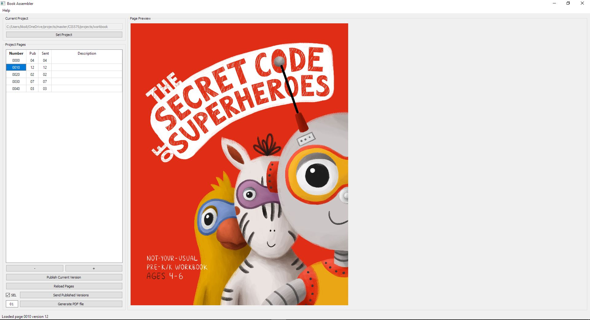

Intro
=====
The Book Assembler is an application that manages pages for the workbook.

Process
=======
The process of book developing includes such phases: concept, design, layout, and printing.

During concept phase the Book Author creates the draft version of the book that consist of a page sketches.
Once concept is done each page is saved as a jpeg file and sent to Illustrator.

At the design phase illustrator creates the final illustrations and return them back to author for review and storage.
Author place illustrations into the same folder with pages. Author decides when page is finalized and publishes
the finalized version (record the approved version to the database).

Once all Illustrations are finalized, they being send to layout artist who creates a Print PDF file for printing.
This file is sent to a printing facility to produce the circulation of the book.

The book development process is not linear, each page goes through multiple rounds of revisions, and hence
each page file has multiple versions.

The pages that Author sending to Layout Artist does not contain version component in the file name,
which allows automatic update of all pages to the final in Layout Software.

Assembler UI
============
The Book Assembler UI description.

Menu
----
Book Assembler contains Edit > Modify Settings and Help > Documentation items.

Main area
---------
The Book Assembler UI contains two parts, *Pages* and *Page Preview*

Status line
-----------
The status line at the bottom of main window outputs messages regarding program actions.